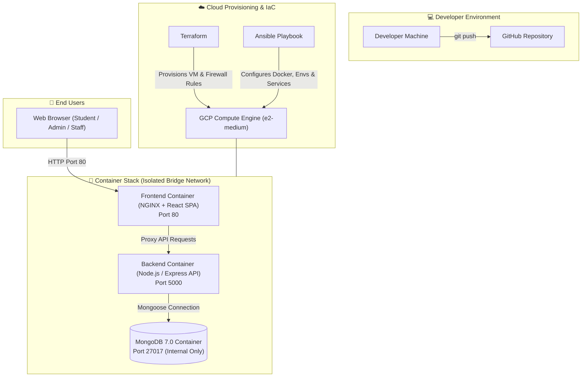
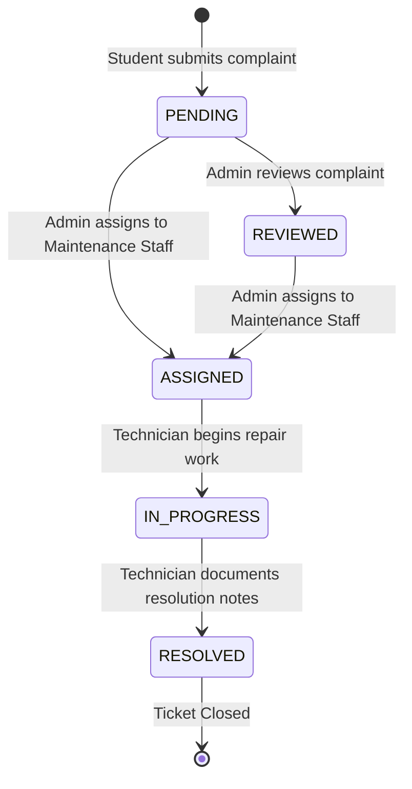

# 🏫 CampusCare

<div align="center">

**Smart Campus Complaint & Facility Management System**

*A modern, full-stack, enterprise-ready complaint lifecycle management platform and automated DevOps infrastructure built for academic institutions.*

[](LICENSE)
[](https://nodejs.org/)
[](https://react.dev/)
[](https://vitejs.dev/)
[](https://tailwindcss.com/)
[](https://expressjs.com/)
[](https://www.mongodb.com/)
[](https://www.docker.com/)
[](https://www.terraform.io/)
[](https://www.ansible.com/)
[](https://cloud.google.com/)
[](https://github.com/SwayamMandhani06/CampusCare/pulls)

[Key Features](#-key-features--role-based-workflows) •
[Architecture](#-system-architecture--data-flow) •
[Tech Stack](#-technology-stack) •
[REST APIs](#-rest-api-reference) •
[Local Setup](#-getting-started--local-development) •
[Cloud Deployment](#-infrastructure-as-code--cloud-deployment) •
[Demo Credentials](#-demo-credentials--evaluation-guide)

</div>

---

## 📌 Executive Overview

**CampusCare** is a centralized facility and complaint management system engineered specifically for colleges, universities, and educational institutions. It establishes an accountable, transparent, role-based workflow connecting **Students** who report infrastructure defects, **Administrators** who triage and assign issues, and **Maintenance Staff** who resolve and document maintenance operations in real time.

```
                  ┌─────────────────────────────────────────────────────────┐
                  │                 CAMPUSCARE CORE SYSTEM                  │
                  └─────────────────────────────────────────────────────────┘
                                               │
             ┌─────────────────────────────────┼────────────────────────────────┐
             │                                 │                                │
             ▼                                 ▼                                ▼
     🎓 STUDENT PORTAL               🛡️ ADMIN CONSOLE               🔧 STAFF WORKBENCH
 • Raise facility complaints       • Real-time analytics charts      • Priority-ordered queue
 • 5-stage status timeline rail    • Triage & staff assignment       • Status lifecycle transitions
 • Filter & edit pending tickets   • Dynamic priority escalation     • Resolution notes & logging
 • Live dashboard counters         • Full audit trail & user hub     • Instant repair documentation
```

---

## 💡 Problem & Solution

| The Traditional Challenge ❌ | The CampusCare Solution ✅ |
|:---|:---|
| **Fragmented Reporting**: Verbal complaints, lost emails, and chaotic WhatsApp groups lead to dropped tickets. | **Single Source of Truth**: Unified web portal capturing structured ticket data with categorical tagging and location details. |
| **Zero Transparency**: Students have no visibility into who is handling their issue or estimated resolution time. | **Visual 5-Stage Timeline**: Real-time status tracker (`PENDING` → `REVIEWED` → `ASSIGNED` → `IN_PROGRESS` → `RESOLVED`). |
| **Unmonitored Bottlenecks**: Facility administrators lack insights into high-failure zones and staff workloads. | **Interactive Analytics Hub**: Dynamic breakdown of complaints by category, status, and urgency powered by interactive charts. |
| **Lack of Accountability**: No formal record of technician diagnosis, repair notes, or timeline changes. | **Immutable Audit Logs**: Timestamped status history tracking every status change, assignor, and technician resolution report. |

---

## 🌟 Key Features & Role-Based Workflows

### 🎓 1. Student Portal
- **Complaint Creation**: Intuitive form with validation for title, detailed description, categorized department (Electrical, Plumbing, WiFi, Furniture, Equipment, Cleanliness, Hostel, Classroom), exact campus location, and severity level.
- **Interactive Dashboard**: Real-time counter metrics displaying total, pending, in-progress, and resolved complaints.
- **Visual Status Rail**: 5-stage visual progress timeline showing exact stage, timestamp, and technician resolution notes.
- **Search & Filtering**: Search tickets by title or description; filter dynamically by category and lifecycle status.
- **Inline Ticket Modification**: Modify complaint details while the ticket remains in `PENDING` state.

### 🛡️ 2. Administrator Control Hub
- **Executive Analytics Dashboard**: Summary KPIs with visual category distribution and status breakdown charts (powered by Recharts).
- **Triage & Assignment Console**: Comprehensive issue workbench to assign tasks to specific maintenance staff members.
- **Dynamic Priority Escalation**: Upgrade priority (`LOW` → `MEDIUM` → `HIGH` → `CRITICAL`) with automatic audit log tracking.
- **Audit & Governance Trail**: Every status transition, note, and assignment is timestamped and attributed to the acting administrator.
- **User Directory**: View, search, and manage registered students, technicians, and administrators.

### 🔧 3. Maintenance Staff Workbench
- **Priority-Driven Task Queue**: Smart task list sorted automatically with critical and high-priority emergencies at the top.
- **One-Click State Transitions**: Acknowledge and transition assigned tickets into `IN_PROGRESS` when on-site work begins.
- **Resolution Documentation**: Formally resolve complaints with mandatory technician repair notes and diagnostics.

---

## 🏗️ System Architecture & Data Flow

### 1. DevOps & Cloud Infrastructure Architecture



### 2. Complaint State Machine Lifecycle



---

## 💻 Technology Stack

| Domain | Technology | Version | Description / Purpose |
|:---|:---|:---|:---|
| **Frontend UI** | [React](https://react.dev/) | `19.2` | Component-driven Single Page Application (SPA) |
| **Build Tool** | [Vite](https://vitejs.dev/) | `8.2` | Ultra-fast frontend development server & bundler |
| **Styling** | [Tailwind CSS](https://tailwindcss.com/) | `3.4` | Modern utility-first responsive styling |
| **Animations** | [Framer Motion](https://www.framer.com/motion/) | `13.1` | Fluid UI animations and state transitions |
| **Icons & Charts** | [Lucide React](https://lucide.dev/) & [Recharts](https://recharts.org/) | `1.38` / `3.10` | Sleek icon set and dynamic data visualizations |
| **Backend API** | [Node.js](https://nodejs.org/) & [Express](https://expressjs.com/) | `v18+` / `4.21` | RESTful API server with modular route controllers |
| **Database** | [MongoDB](https://www.mongodb.com/) & [Mongoose](https://mongoosejs.com/) | `7.0` / `8.9` | NoSQL document database with schema validation |
| **Security & Auth** | [JWT](https://jwt.io/) & [bcryptjs](https://github.com/dcodeIO/bcrypt.js) | `9.0` / `2.4` | Stateless bearer token authentication & password hashing |
| **Containers** | [Docker](https://www.docker.com/) & [Docker Compose](https://docs.docker.com/compose/) | `v2+` | Multi-stage container builds and microservice orchestration |
| **Web Server** | [NGINX](https://nginx.org/) | `Alpine` | Production reverse proxy, static asset server, SPA routing |
| **IaC** | [Terraform](https://www.terraform.io/) | `v1.5+` | Declarative cloud resource provisioning on GCP |
| **Config Mgmt** | [Ansible](https://www.ansible.com/) | `v2.15+` | Automated host configuration, Docker setup, and deployment |
| **Cloud** | [Google Cloud Platform](https://cloud.google.com/) | `GCP` | Compute Engine VM instance, VPC, and firewall rules |

---

## 📡 REST API Reference

All protected endpoints require the HTTP header:  
`Authorization: Bearer <JWT_TOKEN>`

### 🔑 1. Authentication Routes (`/api/auth`)
| Method | Endpoint | Access | Description |
|:---|:---|:---|:---|
| `POST` | `/api/auth/register` | Public | Register a new student account (`name`, `email`, `password`, `studentId`) |
| `POST` | `/api/auth/login` | Public | Authenticate user and receive signed JWT token |
| `GET` | `/api/auth/me` | Protected | Fetch current logged-in user profile |

### 📝 2. Complaints Management (`/api/complaints`)
| Method | Endpoint | Access | Description |
|:---|:---|:---|:---|
| `POST` | `/api/complaints` | Student / User | Submit a new campus complaint ticket |
| `GET` | `/api/complaints` | Student / User | Retrieve all complaints created by the logged-in user |
| `GET` | `/api/complaints/:id` | Protected | Retrieve full complaint details including status history |
| `PUT` | `/api/complaints/:id` | Student (Owner) | Update complaint details (only valid while `PENDING`) |

### 🛡️ 3. Administrator Console (`/api/admin`)
| Method | Endpoint | Access | Description |
|:---|:---|:---|:---|
| `GET` | `/api/admin/dashboard` | Admin Only | Get aggregated analytics, status counts, and category breakdown |
| `GET` | `/api/admin/complaints` | Admin Only | List all campus complaints with search, category, and status filters |
| `PUT` | `/api/admin/complaints/:id/assign` | Admin Only | Assign complaint to a staff member and update priority |
| `PUT` | `/api/admin/complaints/:id/status` | Admin Only | Update complaint status and append administrative notes |
| `GET` | `/api/admin/users` | Admin Only | Fetch directory of all registered campus users |

### 🔧 4. Maintenance Staff Workbench (`/api/staff`)
| Method | Endpoint | Access | Description |
|:---|:---|:---|:---|
| `GET` | `/api/staff/tasks` | Staff Only | Get all assigned tasks sorted by priority (`CRITICAL` → `HIGH` → `MED` → `LOW`) |
| `PUT` | `/api/staff/tasks/:id/status` | Staff Only | Update task status (e.g. transition from `ASSIGNED` to `IN_PROGRESS`) |
| `PUT` | `/api/staff/tasks/:id/resolve` | Staff Only | Mark task as `RESOLVED` with mandatory technician repair notes |

### 🩺 5. System Health (`/api/health`)
| Method | Endpoint | Access | Description |
|:---|:---|:---|:---|
| `GET` | `/api/health` | Public | Returns service status and timestamp |

---

## 🗄️ Database Schemas & Data Models

### 👤 User Model
```json
{
  "_id": "ObjectId",
  "name": "Aarav Sharma",
  "email": "aarav.sharma@pccoepune.org",
  "password": "$2a$10$hashed_password_string...",
  "role": "student | admin | staff",
  "studentId": "123B1B201",
  "createdAt": "2026-09-01T10:00:00.000Z",
  "updatedAt": "2026-09-01T10:00:00.000Z"
}
```

### 📋 Complaint Model
```json
{
  "_id": "ObjectId",
  "title": "Ceiling Fan Regulators Loose in LH-302",
  "description": "Two ceiling fans in Lecture Hall 302 have malfunctioning switches causing sparking.",
  "category": "Classroom Infrastructure",
  "location": "Academic Complex 2, 3rd Floor, Room LH-302",
  "priority": "MEDIUM",
  "status": "PENDING",
  "createdBy": "ObjectId (ref: User)",
  "assignedTo": "ObjectId (ref: User, nullable)",
  "resolutionNotes": "",
  "statusHistory": [
    {
      "_id": "ObjectId",
      "status": "PENDING",
      "changedBy": "ObjectId (ref: User)",
      "notes": "Initial issue reported via student portal.",
      "changedAt": "2026-09-01T10:00:00.000Z"
    }
  ],
  "createdAt": "2026-09-01T10:00:00.000Z",
  "updatedAt": "2026-09-01T10:00:00.000Z"
}
```

---

## 🚀 Getting Started & Local Development

### 📋 Prerequisites
Ensure you have the following installed locally:
- [Git](https://git-scm.com/) (`v2.30+`)
- [Docker](https://www.docker.com/) & [Docker Compose](https://docs.docker.com/compose/) (`v2.0+`)
- *Optional (for non-dockerized manual dev)*: [Node.js](https://nodejs.org/) (`v18+`) & [MongoDB](https://www.mongodb.com/) (`v6+`)

---

### Option A: Quickstart with Docker Compose (Recommended)

1. **Clone the repository:**
   ```bash
   git clone https://github.com/SwayamMandhani06/CampusCare.git
   cd CampusCare
   ```

2. **Configure Environment Variables:**
   ```bash
   cp .env.example .env
   ```

3. **Build & Start Services:**
   ```bash
   docker compose up --build -d
   ```

4. **Seed Demonstration Accounts & Complaints:**
   ```bash
   docker compose exec backend node seed.js
   ```

5. **Access Application:**
   - 🌐 **Frontend Application**: [http://localhost](http://localhost)
   - 🔌 **Backend REST API**: [http://localhost:5000/api](http://localhost:5000/api)
   - 🩺 **Health Check**: [http://localhost:5000/api/health](http://localhost:5000/api/health)

6. **Stop All Containers:**
   ```bash
   docker compose down -v
   ```

---

### Option B: Manual Local Development

#### 1. Start Backend
```bash
cd backend
cp .env.example .env
npm install
npm run seed     # Seeds initial users and tickets
npm run dev      # Starts nodemon on http://localhost:5000
```

#### 2. Start Frontend
```bash
cd ../frontend
npm install
npm run dev      # Starts Vite dev server on http://localhost:5173
```

---

## ⚙️ Environment Variables Reference

A `.env.example` template is provided in the repository root:

| Variable | Default Value | Description |
|:---|:---|:---|
| `MONGO_INITDB_ROOT_USERNAME` | `admin` | MongoDB root administrator username |
| `MONGO_INITDB_ROOT_PASSWORD` | `campuscare_secure_password_2026` | MongoDB root administrator password |
| `PORT` | `5000` | Port for Express backend API |
| `JWT_SECRET` | `campuscare_super_secret_jwt_key_2026` | Secret key for signing JWT bearer tokens |
| `VITE_API_URL` | `http://localhost:5000` | Target URL for frontend API calls (use public IP for VM deployment) |

---

## ☁️ Infrastructure as Code & Cloud Deployment

CampusCare includes complete production-grade automation using **Terraform** for GCP cloud infrastructure provisioning and **Ansible** for configuration management.

```
┌─────────────────┐       ┌────────────────────────┐       ┌────────────────────────┐
│  Terraform IaC  │  ───> │  GCP Compute Engine VM │  ───> │  Ansible Orchestration │
│  (main.tf)      │       │  (Ubuntu 24.04 LTS)    │       │  (deploy.yml)          │
└─────────────────┘       └────────────────────────┘       └────────────────────────┘
```

### Step 1: Provision Infrastructure with Terraform
```bash
cd terraform

# 1. Initialize provider plugins
terraform init

# 2. Review execution plan
terraform plan

# 3. Provision Compute Engine instance & firewall rules
terraform apply
```

*Terraform will output the VM's public IP address upon completion.*

### Step 2: Configure VM & Deploy with Ansible
```bash
cd ../ansible

# 1. Test host connectivity
ansible all -i inventory.ini -m ping

# 2. Execute end-to-end configuration and deployment
ansible-playbook -i inventory.ini deploy.yml
```

**The Ansible Playbook automatically:**
1. Updates APT repositories and installs system dependencies.
2. Configures the official Docker repository and installs Docker Engine & Docker Compose.
3. Synchronizes the repository source code to the remote host.
4. Templates production `.env` configuration.
5. Builds and launches the multi-container stack (`docker compose up --build -d`).
6. Executes `node seed.js` inside the backend container to populate baseline accounts.

---

## 🧪 Testing & Quality Assurance

The backend includes built-in verification scripts with self-contained in-memory MongoDB support:

```bash
# Run Authentication & Role Access Verification
cd backend
npm run test:auth

# Run Full Complaint Lifecycle & Workflow Verification
npm run test:complaints
```

**Frontend Linting & Static Code Analysis:**
```bash
cd frontend
npm run lint
```

---

## 🔑 Demo Credentials & Evaluation Guide

The database seeder (`node seed.js`) pre-populates three distinct role profiles for evaluation:

| Role | Email | Password | Access / Purpose |
|:---|:---|:---|:---|
| **Campus Administrator** | `admin@pccoepune.org` | `Admin@12345` | Full administrative console, triage workbench, analytics, user directory |
| **Maintenance Staff** | `staff@pccoepune.org` | `Staff@12345` | Priority task queue, work status transitions, resolution reporting |
| **Student (Demo 1)** | `aarav.sharma@pccoepune.org` | `Student@12345` | Complaint submission, active ticket tracking, personal dashboard |
| **Student (Demo 2)** | `neha.patil@pccoepune.org` | `Student@12345` | Secondary student account for multi-user testing |

---

## 📂 Project Directory Structure

```text
CampusCare/
├── 📁 .github/                  # GitHub workflows & templates
├── 📁 ansible/                  # Ansible automation & configuration management
│   ├── ansible.cfg              # Ansible configuration & SSH settings
│   ├── deploy.yml               # Production deployment playbook
│   └── inventory.ini            # Target host inventory file
├── 📁 backend/                  # Node.js & Express.js REST API
│   ├── config/                  # Database connection (Mongoose / MongoDB)
│   ├── controllers/             # Request handlers (auth, complaints, admin, staff)
│   ├── middleware/              # JWT verification & RBAC authorization
│   ├── models/                  # Data models (User, Complaint)
│   ├── routes/                  # Express route routers
│   ├── Dockerfile               # Alpine-based Node.js runtime container
│   ├── package.json             # Backend dependencies & test scripts
│   ├── seed.js                  # Database seeder for demo data
│   ├── server.js                # Express application entrypoint
│   ├── test-auth.js             # Authentication integration test suite
│   └── test-complaints.js       # Complaint lifecycle test suite
├── 📁 frontend/                 # React 19 + Vite client application
│   ├── src/
│   │   ├── assets/              # Static assets & illustrations
│   │   ├── components/          # Reusable UI components (Navbar, Modal, Timeline)
│   │   ├── context/             # AuthContext & global state providers
│   │   ├── layouts/             # Base layout wrappers
│   │   ├── pages/               # Role-specific views (Student, Admin, Staff)
│   │   ├── services/            # Axios API client services
│   │   ├── App.jsx              # Application router & protected routes
│   │   └── main.jsx             # React entry point
│   ├── Dockerfile               # Multi-stage production build (Node builder -> NGINX)
│   ├── nginx.conf               # NGINX reverse proxy & SPA fallback configuration
│   ├── package.json             # Frontend dependencies & build scripts
│   ├── tailwind.config.js       # Tailwind CSS configuration
│   └── vite.config.js           # Vite build configuration
├── 📁 terraform/                # Infrastructure as Code (Google Cloud Platform)
│   ├── main.tf                  # GCP Compute Engine instance & firewall rules
│   ├── outputs.tf               # Terraform output values (Public IP, SSH command)
│   ├── providers.tf             # Google provider specification
│   ├── terraform.tfvars.example # Variables configuration template
│   └── variables.tf             # Configurable infrastructure variables
├── .env.example                 # Root environment variables template
├── .gitignore                   # Git ignore patterns
├── docker-compose.yml           # Multi-container orchestration specification
├── LICENSE                      # MIT Open-Source License
└── README.md                    # Project documentation
```

---

## 🔒 Security & Best Practices

- **Stateless JWT Authentication**: Secure, digitally signed bearer tokens expire automatically to prevent session hijacking.
- **Bcrypt Password Hashing**: Passwords are salted and hashed (10 rounds) before persisting to MongoDB; plain text passwords are never stored.
- **Role-Based Access Control (RBAC)**: Strict server-side route guards prevent unauthorized role privilege escalation.
- **Database Network Isolation**: MongoDB operates exclusively within an internal Docker bridge network (`campuscare-net`), preventing external direct database exposure.
- **Multi-Stage Docker Builds**: Frontend images use lightweight Alpine NGINX runtime containers, stripping dev dependencies and keeping attack surfaces minimal.

---

## 🤝 Contributing

Contributions make the open-source community an amazing place to learn, inspire, and create. Any contributions you make are **greatly appreciated**.

1. Fork the Project (`https://github.com/SwayamMandhani06/CampusCare`)
2. Create your Feature Branch (`git checkout -b feature/AmazingFeature`)
3. Commit your Changes (`git commit -m 'feat: Add some AmazingFeature'`)
4. Push to the Branch (`git push origin feature/AmazingFeature`)
5. Open a Pull Request

---

## 📄 License

Distributed under the **MIT License**. See [`LICENSE`](LICENSE) for more information.

---

## 👨‍💻 Maintainer & Acknowledgements

- **Author**: [Swayam Mandhani](https://github.com/SwayamMandhani06)
- **Organization**: Pimpri Chinchwad College of Engineering (PCCOE)
- **Repository**: [https://github.com/SwayamMandhani06/CampusCare](https://github.com/SwayamMandhani06/CampusCare)

<div align="center">

*Built with ❤️ for smarter, cleaner, and more accountable campuses.*

</div>
