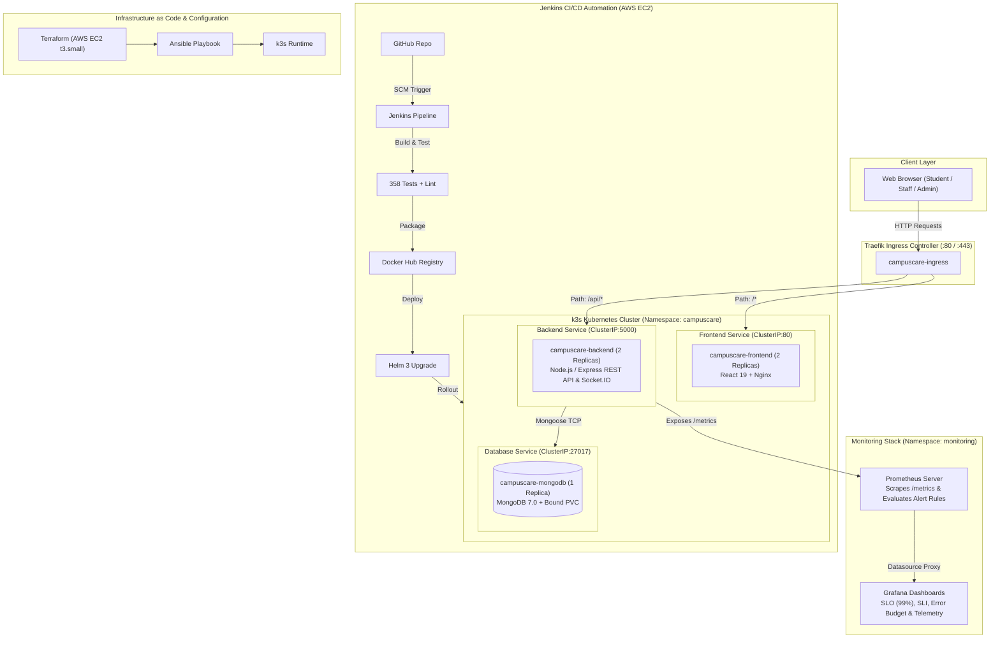

# CampusCare

[](Jenkinsfile)
[](helm/campuscare)
[](helm/campuscare)
[](monitoring)
[](monitoring)
[](backend)
[](LICENSE)

CampusCare is a smart campus complaint and facility management platform that enables students to raise and track complaints while providing staff and administrators with real-time workflows, SLA automation, intelligent classification, operational analytics, and DevOps-driven deployment and monitoring.

---

## Overview

CampusCare resolves fragmented communication and unmonitored maintenance bottlenecks across academic institutions by providing a single source of truth for campus facility operations. Key capabilities include:

- **Role-Based Workflows**: Tailored portals for Students, Maintenance Staff, and Administrators.
- **Real-Time Synchronization**: Instant status updates, comments, and notifications powered by Socket.IO.
- **SLA Governance & Automation**: Deterministic response/resolution deadlines with automated supervisory escalation.
- **Platform Intelligence**: Rule-based priority evaluation, explainable duplicate detection, staff recommendations, and optional AI classification with zero-failure fallbacks.
- **Executive Analytics**: Multi-dimensional trend analysis, campus hotspots, technician performance, and CSV exports.
- **Production-Style SRE Observability**: Full-stack Prometheus instrumentation, Grafana SLO/SLI dashboards, and Kubernetes self-healing.

---

## Key Features

### Student Portal
- **Ticket Lifecycle**: Submit structured complaints with category, location, and severity details.
- **Media Attachments**: Upload up to 5 verified images (JPEG, PNG, WebP) with secure authenticated viewing.
- **Visual Progress Rail**: Real-time 5-stage status timeline (`PENDING` → `REVIEWED` → `ASSIGNED` → `IN_PROGRESS` → `RESOLVED`).
- **Interactive Review**: Pre-submission duplicate detection modal to review or link related active issues.
- **Engagement**: In-app notification center, collaborative comments thread, and post-resolution 5-star feedback rating.

### Maintenance Staff Workbench
- **Priority Queue**: Work orders sorted automatically by urgency with critical emergencies at the top.
- **SLA Telemetry**: Live time-remaining/overdue countdown badges and escalation indicators.
- **State Execution**: One-click transition to `IN_PROGRESS` upon technician arrival.
- **Formal Resolution**: Mandatory diagnostic repair notes and root-cause documentation upon closure.

### Administrator Console
- **Triage & Dispatch**: Issue triage workbench with explainable staff recommendations for optimal technician assignment.
- **Priority Governance**: Audited manual priority overrides requiring written justification.
- **SLA & Escalations**: Monitoring of breached complaints with automated multi-tier escalation tracking.
- **User Management**: Centralized directory managing student, staff, and administrator accounts.
- **Operational Analytics**: Comprehensive Recharts dashboards with interactive drill-down to filtered complaint queues.

### Platform Intelligence
- **Deterministic Priority Engine**: Rule-based classification evaluating safety hazards (fire, sparking, flooding) in sub-milliseconds without external dependencies.
- **AI Classification & Fallback**: Provider-abstracted AI classification (`classificationService.js`) with automatic fallback to rule-based evaluation. Manual administrator overrides are strictly preserved.
- **Duplicate Detection**: Explainable token similarity (Jaccard) combined with category and location scoring over recent active tickets.
- **Smart Staff Recommendations**: Multi-factor scoring balancing specialization match (50%), active workload (30%), and SLA health (20%).
- **Real-Time Architecture**: Authenticated WebSockets (`/api/socket.io`) with role-scoped room isolation.

### DevOps & Observability
- **Infrastructure as Code**: AWS EC2 provisioning via Terraform (`terraform-aws/`).
- **Configuration Management**: Server setup and runtime automation via Ansible (`ansible-aws/`).
- **Containerization & Packaging**: Dockerized multi-stage builds and parameterized Helm 3 chart (`helm/campuscare/`).
- **Automated CI/CD**: Declarative Jenkins pipeline with sequential builds, image registry publishing, and rolling deployments.
- **SRE Monitoring**: Prometheus metric scraping, alert rules, Grafana SLO dashboards (99% availability target), and Kubernetes self-healing.

---

## Architecture

CampusCare follows a modular monolithic application architecture. The backend is structured into modular domain services and controllers deployed as a containerized application within a Kubernetes platform. The frontend, backend, and MongoDB run as separate containerized services.


```mermaid
flowchart TD
    subgraph Client_Layer["Client Layer"]
        Browser["Web Browser (Student / Staff / Admin)"]
    end

    subgraph Ingress_Layer["Traefik Ingress Controller (:80 / :443)"]
        Ingress["campuscare-ingress"]
    end

    subgraph Kubernetes_Cluster["k3s Kubernetes Cluster (Namespace: campuscare)"]
        subgraph Frontend_Service["Frontend Service (ClusterIP:80)"]
            FE_Pods["campuscare-frontend (2 Replicas)\nReact 19 + Nginx"]
        end

        subgraph Backend_Service["Backend Service (ClusterIP:5000)"]
            BE_Pods["campuscare-backend (2 Replicas)\nNode.js / Express REST API & Socket.IO"]
        end

        subgraph Database_Service["Database Service (ClusterIP:27017)"]
            DB_Pod[("campuscare-mongodb (1 Replica)\nMongoDB 7.0 + Bound PVC")]
        end
    end

    subgraph Monitoring_Stack["Monitoring Stack (Namespace: monitoring)"]
        Prometheus["Prometheus Server\nScrapes /metrics & Evaluates Alert Rules"]
        Grafana["Grafana Dashboards\nSLO (99%), SLI, Error Budget & Telemetry"]
    end

    subgraph CI_CD_Pipeline["Jenkins CI/CD Automation (AWS EC2)"]
        GitHub["GitHub Repo"] -->|SCM Trigger| Jenkins["Jenkins Pipeline"]
        Jenkins -->|Build & Test| Tests["358 Tests + Lint"]
        Tests -->|Package| DockerHub["Docker Hub Registry"]
        DockerHub -->|Deploy| Helm["Helm 3 Upgrade"]
        Helm -->|Rollout| Kubernetes_Cluster
    end

    subgraph Infrastructure_Layer["Infrastructure as Code & Configuration"]
        TF["Terraform (AWS EC2 t3.small)"] --> Ansible["Ansible Playbook"] --> k3s["k3s Runtime"]
    end

    Browser -->|HTTP Requests| Ingress
    Ingress -->|Path: /*| Frontend_Service
    Ingress -->|Path: /api/*| Backend_Service
    Backend_Service -->|Mongoose TCP| Database_Service
    Backend_Service -->|Exposes /metrics| Prometheus
    Prometheus -->|Datasource Proxy| Grafana
```

---

## Technology Stack

| Layer | Technology | Version | Purpose |
|:---|:---|:---|:---|
| **Frontend** | React, Vite, Tailwind CSS | React 19, Vite 8, Tailwind 3.4 | Single Page Application with accessible dark/light themes |
| **Backend** | Node.js, Express.js | Node 18+, Express 4.21 | Modular RESTful API and WebSocket service |
| **Database** | MongoDB, Mongoose | MongoDB 7.0, Mongoose 8.9 | Persistent document storage and distributed locking |
| **Authentication** | JWT, bcryptjs | jsonwebtoken 9.0, bcryptjs 2.4 | Stateless bearer token auth and salted password hashing |
| **Real-Time** | Socket.IO | Socket.IO 4.8 | Low-latency duplex event broadcasting and room RBAC |
| **Testing** | Node test runner, mongodb-memory-server | Built-in / In-memory | 358 automated integration and lifecycle unit tests |
| **Containerization**| Docker | 24+ | Multi-stage production container builds |
| **Container Registry**| Docker Hub | Cloud | Immutable Git SHA image repository (`swayammandhani06`) |
| **Orchestration** | Kubernetes / k3s | v1.31+ | Single-node lightweight Kubernetes cluster |
| **Packaging** | Helm | Helm 3 | Parameterized chart deployment and lifecycle management |
| **CI/CD** | Jenkins | LTS (Declarative Pipeline) | Automated checkout, testing, building, pushing, and deployment |
| **Infrastructure** | Terraform | v1.5+ | Declarative AWS EC2 infrastructure provisioning |
| **Configuration** | Ansible | v2.15+ | Host package configuration, Docker, k3s, and Helm installation |
| **Monitoring** | Prometheus | v2.54+ | Time-series metric collection and alert rule evaluations |
| **Visualization** | Grafana | v11.1+ | SRE dashboards, SLI/SLO tracking, and alert visualization |
| **Cloud Provider** | AWS EC2 | `t3.small` (`ap-south-1`) | Production-style academic deployment host |

---

## CI/CD Pipeline

CampusCare uses a **Declarative Jenkins Pipeline** (`Jenkinsfile`) as its primary automated deployment engine:

```
GitHub Push ──> Jenkins Checkout ──> Install Deps (npm ci) ──> Test & Lint (8 Suites)
                                                                       │
Kubernetes Rollout <── Helm Upgrade <── Docker Push <── Docker Build <─┘
         │
Traefik Ingress Health Check (/api/health) ──> Zero-Downtime Live
```

1. **Deterministic Tagging**: Derives an immutable 7-character Git SHA (`IMAGE_TAG`) for image traceability.
2. **Comprehensive Verification**: Executes all 7 backend test suites (358 tests) and frontend static linting before any build occurs.
3. **Resource-Conscious Building**: Sequentially builds backend and frontend images to respect EC2 `t3.small` memory limits.
4. **Secure Registry Push**: Authenticates with Docker Hub via Jenkins credentials store without process-level token exposure.
5. **Atomic Helm Upgrades**: Executes `helm upgrade --install --reuse-values` in namespace `campuscare` to perform rolling pod upgrades.
6. **Automated Rollout & Probing**: Verifies replica readiness via `kubectl rollout status` and validates HTTP 200 health via Traefik Ingress.

---

## Observability & SRE

CampusCare implements production-style observability and Site Reliability Engineering (SRE) principles:

- **Application Telemetry**: Backend exposes Prometheus metrics at `/metrics` via `prom-client` (`campuscare_http_requests_total`, `campuscare_http_errors_total`, `campuscare_http_request_duration_seconds`, active Socket.IO connections, SLA gauges, and duplicate checks).
- **Service Level Objectives (SLO)**: Formally tracks a **99.0% Availability SLO** with a **1.0% Error Budget** evaluated over rolling operational windows.
- **Alerting Rules**: Prometheus evaluates operational alert rules (`CampusCareBackendDown`, `CampusCareHighErrorRate`, `CampusCareHighLatency`, `CampusCarePodHealth`).
- **Grafana SRE Dashboard**: 14 operational panels visualizing uptime SLI, error budget burn, p95/p99 latencies, pod CPU/memory consumption, and SLA escalation counters.
- **Kubernetes Self-Healing**: Backend and frontend deployments configure HTTP readiness and liveness probes; pods automatically restart upon transient faults with zero service downtime.

---

## Advanced Analytics

The dedicated Analytics Hub (`/admin/analytics`) provides deep operational intelligence for campus facility management:

- **Trend Analysis**: Visualizes complaint volume, resolution velocity, and backlog growth over configurable windows (`7d`, `30d`, `90d`, `6m`, `1y`, or custom date ranges).
- **Multi-Dimensional Filtering**: Real-time cross-filtering across 9 facility categories, 4 priority levels, 5 lifecycle states, and 4 SLA conditions.
- **Facility Hotspots**: Identifies physical campus locations with high complaint frequencies, severe hazards, and repeated SLA breaches.
- **Staff Performance Matrix**: Sortable technician metrics tracking assigned volume, active workload, SLA compliance rate, and average resolution time.
- **Period-over-Period Telemetry**: Automated comparisons evaluating volume change percentage, resolution speed variance, and SLA delta against preceding periods.
- **Interactive Drill-Down**: Clicking any chart bar, slice, or technician navigates directly to pre-filtered complaint lists.
- **Executive CSV Export**: Downloads multi-section operational reports with formula sanitization defending against spreadsheet injection (`=`, `+`, `-`, `@`).

---

## Security

CampusCare enforces defense-in-depth protections across all layers:

- **Authentication & Hashing**: Stateless JSON Web Tokens (JWT) and salted bcrypt password hashing (10 rounds). Double-hashing protections prevent hash corruption on user re-save.
- **Role-Based Access Control (RBAC)**: Strict server-side route guards enforcing Student, Staff, and Administrator boundaries.
- **Media Upload Validation**: Multi-layer image inspection validating file extensions, MIME types, size thresholds (5MB), and binary magic signatures (`JPEG`, `PNG`, `WebP`).
- **WebSocket Isolation**: Handshake authentication and scoped Socket.IO rooms prevent cross-ticket eavesdropping.
- **CSV Injection Prevention**: All exported CSV cells are sanitized against spreadsheet formula injection attacks.
- **Network Isolation**: MongoDB runs without public port exposure, communicating exclusively over the internal cluster network.
- **Secret Hygiene**: Zero production secrets, private keys, or cloud credentials are committed to version control.

---

## Project Structure

```text
CampusCare/
├── ansible-aws/             # Ansible playbooks and host configuration for AWS EC2
├── backend/                 # Node.js & Express REST API and Socket.IO server
│   ├── config/              # Database connection and environment setup
│   ├── controllers/         # Route controllers (auth, complaints, admin, staff, analytics)
│   ├── middleware/          # JWT auth, role RBAC, upload validation
│   ├── models/              # Mongoose models (User, Complaint, Notification, SystemLock)
│   ├── routes/              # Express API route declarations
│   ├── services/            # SLA, priority, classification, duplicate, and recommendation logic
│   ├── seed.js              # Idempotent database seeder with realistic demo data
│   ├── server.js            # Express application entry point & Socket.IO listener
│   └── test-*.js            # 7 automated test suites (358 tests)
├── frontend/                # React 19 + Vite client application
│   ├── src/
│   │   ├── components/      # UI components (Navbar, Modal, Timeline, Cards, Badges)
│   │   ├── context/         # AuthContext and SocketContext state providers
│   │   ├── layouts/         # Role layout wrappers (AdminLayout, StaffLayout)
│   │   ├── pages/           # Pages (Landing, Auth, Student, Staff, Admin)
│   │   └── services/        # Axios API client and Socket.IO services
│   ├── tailwind.config.js   # Tailwind CSS configuration with design system tokens
│   └── vite.config.js       # Vite build configuration
├── helm/                    # Production Helm 3 chart
│   └── campuscare/          # Templates, values.yaml, and Chart.yaml
├── k8s/                     # Raw Kubernetes baseline manifests
├── monitoring/              # Prometheus alert rules, Grafana dashboards, and SRE runbooks
├── terraform-aws/           # Terraform configuration for AWS EC2 infrastructure
├── Jenkinsfile              # Declarative Jenkins CI/CD pipeline
├── docker-compose.yml       # Local multi-container development configuration
├── LICENSE                  # MIT Open-Source License
└── README.md                # Project documentation
```

---

## Local Development

### Prerequisites
- [Node.js](https://nodejs.org/) (`v18+`) and `npm` (`v9+`)
- [MongoDB](https://www.mongodb.com/) (`v6+`) running locally or via Docker
- [Git](https://git-scm.com/)

### Step-by-Step Setup

1. **Clone the repository:**
   ```bash
   git clone https://github.com/SwayamMandhani06/CampusCare.git
   cd CampusCare
   ```

2. **Configure Environment Variables:**
   ```bash
   cp .env.example .env
   cp backend/.env.example backend/.env
   ```

3. **Install Dependencies:**
   ```bash
   cd backend && npm install
   cd ../frontend && npm install
   cd ..
   ```

4. **Seed Database with Demo Accounts & Complaints:**
   ```bash
   cd backend
   npm run seed:demo
   ```

5. **Start Services:**
   - **Backend API**:
     ```bash
     cd backend
     npm run dev     # Runs on http://localhost:5000
     ```
   - **Frontend Client**:
     ```bash
     cd frontend
     npm run dev     # Runs on http://localhost:5173
     ```

---

## Environment Variables

| Variable | Default Value | Description |
|:---|:---|:---|
| `PORT` | `5000` | Port for Express backend API |
| `MONGO_URI` | `mongodb://127.0.0.1:27017/campuscare` | MongoDB connection URI |
| `JWT_SECRET` | `CHANGE_ME_JWT_SECRET` | Secret key for signing JWT tokens |
| `UPLOAD_DIR` | `/app/uploads` | Path for uploaded complaint attachments |
| `MAX_IMAGE_SIZE_MB` | `5` | Maximum upload size per image in megabytes |
| `EMAIL_ENABLED` | `false` | Enables SMTP email notifications (disabled for local dev) |
| `SEED_DEMO_PASSWORD` | `CampusCare@2026` | Deterministic password used by seed scripts |
| `SLA_SCHEDULER_ENABLED`| `true` | Enables background periodic SLA monitoring scheduler |
| `SLA_CHECK_INTERVAL_MS`| `60000` | SLA monitoring cycle interval in milliseconds |
| `SLA_LEASE_TTL_MS` | `45000` | MongoDB distributed lease lock expiration |
| `AI_CLASSIFICATION_ENABLED` | `false` | Enables AI classification provider (falls back to rules) |
| `DUPLICATE_LOOKBACK_DAYS` | `30` | Active complaint lookback window for duplicate detection |

---

## Demo & Seed Data

The database seeder (`cd backend && npm run seed:demo`) safely upserts realistic demo data without duplicates:

| Role | Email | Password | Responsibilities |
|:---|:---|:---|:---|
| **Campus Admin** | `admin@pccoepune.org` | `CampusCare@2026` | Full administrative triage, priority override, analytics, user management |
| **Electrical Staff** | `electrical.staff@pccoepune.org` | `CampusCare@2026` | Electrical hazard repair, SLA countdown, repair note logging |
| **Plumbing Staff** | `plumbing.staff@pccoepune.org` | `CampusCare@2026` | Plumbing repair queue, state transitions, leak resolution |
| **IT Support Staff**| `itsupport.staff@pccoepune.org`| `CampusCare@2026` | Network outages, laboratory computer hardware maintenance |
| **Students** | `student@pccoepune.org` / `aarav.sharma@pccoepune.org` | `CampusCare@2026` | Ticket creation, image upload, status tracking, comments, feedback |

*Note: All demo accounts share the configurable development password `CampusCare@2026` managed via `SEED_DEMO_PASSWORD`.*

---

## Cloud Deployment (AWS + k3s)

The production-style deployment is provisioned on AWS and automated via Jenkins:

1. **Infrastructure as Code (Terraform)**:
   ```bash
   cd terraform-aws
   terraform init
   terraform apply
   ```
   *Provisions an AWS EC2 `t3.small` instance in `ap-south-1` with security groups and storage.*

2. **Configuration Management (Ansible)**:
   ```bash
   cd ansible-aws
   ansible-playbook -i inventory.ini site.yml
   ```
   *Installs Docker, k3s Kubernetes, Helm 3, and Jenkins with cluster privileges.*

3. **Helm Application Packaging**:
   ```bash
   helm upgrade --install campuscare helm/campuscare \
     --namespace campuscare \
     --create-namespace
   ```
   *Deploys Frontend, Backend, MongoDB, PVCs, and Traefik Ingress.*

4. **Automated Jenkins CI/CD**:
   Every push to `main` triggers `Jenkinsfile` to run the 8 test suites, build Docker images, publish to Docker Hub, and execute a zero-downtime rolling Helm upgrade.

---

## Monitoring Access

To securely access Prometheus and Grafana without exposing external ports, use `kubectl port-forward`:

- **Grafana Dashboard**:
  ```bash
  kubectl port-forward svc/grafana 3000:80 -n monitoring
  ```
  *Open [http://localhost:3000](http://localhost:3000) to view the **CampusCare — DevOps Observability & SRE** dashboard.*

- **Prometheus Server**:
  ```bash
  kubectl port-forward svc/prometheus-server 9090:80 -n monitoring
  ```
  *Open [http://localhost:9090](http://localhost:9090) to inspect targets, scrape jobs, and alert rule states.*

---

## Testing & Quality Assurance

CampusCare maintains a comprehensive automated testing suite:

```bash
# Run complete backend test suite (358 tests)
cd backend
npm test

# Run individual test suites
npm run test:auth         # Authentication & RBAC verification (34 tests)
npm run test:complaints   # Complaint lifecycle & transitions (40 tests)
npm run test:metrics      # Prometheus metrics registration (12 tests)
npm run test:batch1       # Batch 1: comments, uploads, notifications (56 tests)
npm run test:batch2       # Batch 2: priority automation, SLA scheduler (86 tests)
npm run test:batch3       # Batch 3: Socket.IO, AI fallback, duplicates, staff recs (59 tests)
npm run test:analytics    # Advanced Analytics & CSV export verification (71 tests)

# Frontend quality checks
cd ../frontend
npm run lint              # Oxlint static code analysis (0 errors)
npm run build             # Production Vite build bundling
```

---

## Academic Project Context (FA1 vs FA2)

To maintain academic grading continuity, this repository documents two evolutionary milestones:

- **Historical Milestone (FA1)**: The initial prototype deployed on Google Cloud Platform (GCP) Compute Engine using Docker Compose. Historical IaC and automation assets are preserved in `/terraform` and `/ansible`.
- **Current Milestone (FA2)**: The production-oriented platform re-architected on AWS EC2 (`t3.small`) using k3s Kubernetes, parameterized Helm 3 packaging, automated Jenkins CI/CD pipeline, and Prometheus/Grafana SRE observability. Current operational assets reside in `/terraform-aws`, `/ansible-aws`, `/k8s`, `/helm`, and `/monitoring`.

---

## License

Distributed under the **MIT License**. See [`LICENSE`](LICENSE) for complete details.
