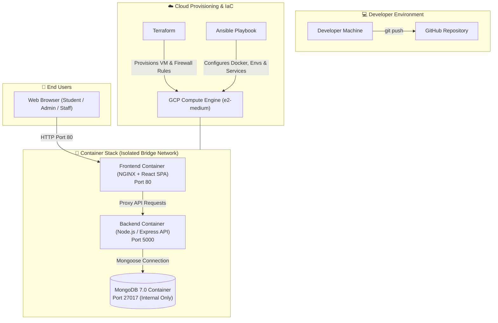
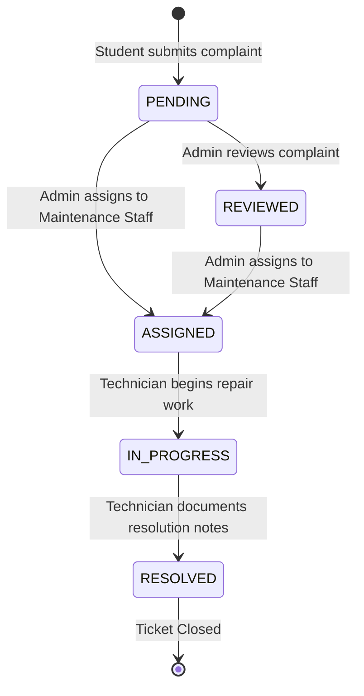

# 🏫 CampusCare

<div align="center">

**Smart Campus Complaint & Facility Management System**

*A modern, full-stack, enterprise-ready complaint lifecycle management platform and automated DevOps infrastructure built for academic institutions.*

[](LICENSE)
[](https://nodejs.org/)
[](https://react.dev/)
[](https://vitejs.dev/)
[](https://tailwindcss.com/)
[](https://expressjs.com/)
[](https://www.mongodb.com/)
[](https://www.docker.com/)
[](https://www.terraform.io/)
[](https://www.ansible.com/)
[](https://cloud.google.com/)
[](https://github.com/SwayamMandhani06/CampusCare/pulls)

[Key Features](#-key-features--role-based-workflows) •
[Architecture](#-system-architecture--data-flow) •
[Tech Stack](#-technology-stack) •
[REST APIs](#-rest-api-reference) •
[Local Setup](#-getting-started--local-development) •
[Cloud Deployment](#-infrastructure-as-code--cloud-deployment) •
[Demo Credentials](#-demo-credentials--evaluation-guide)

</div>

---

## 📌 Executive Overview

**CampusCare** is a centralized facility and complaint management system engineered specifically for colleges, universities, and educational institutions. It establishes an accountable, transparent, role-based workflow connecting **Students** who report infrastructure defects, **Administrators** who triage and assign issues, and **Maintenance Staff** who resolve and document maintenance operations in real time.

```
                  ┌─────────────────────────────────────────────────────────┐
                  │                 CAMPUSCARE CORE SYSTEM                  │
                  └─────────────────────────────────────────────────────────┘
                                               │
             ┌─────────────────────────────────┼────────────────────────────────┐
             │                                 │                                │
             ▼                                 ▼                                ▼
     🎓 STUDENT PORTAL               🛡️ ADMIN CONSOLE               🔧 STAFF WORKBENCH
 • Raise facility complaints       • Real-time analytics charts      • Priority-ordered queue
 • 5-stage status timeline rail    • Triage & staff assignment       • Status lifecycle transitions
 • Filter & edit pending tickets   • Dynamic priority escalation     • Resolution notes & logging
 • Live dashboard counters         • Full audit trail & user hub     • Instant repair documentation
```

---

## 💡 Problem & Solution

| The Traditional Challenge ❌ | The CampusCare Solution ✅ |
|:---|:---|
| **Fragmented Reporting**: Verbal complaints, lost emails, and chaotic WhatsApp groups lead to dropped tickets. | **Single Source of Truth**: Unified web portal capturing structured ticket data with categorical tagging and location details. |
| **Zero Transparency**: Students have no visibility into who is handling their issue or estimated resolution time. | **Visual 5-Stage Timeline**: Real-time status tracker (`PENDING` → `REVIEWED` → `ASSIGNED` → `IN_PROGRESS` → `RESOLVED`). |
| **Unmonitored Bottlenecks**: Facility administrators lack insights into high-failure zones and staff workloads. | **Interactive Analytics Hub**: Dynamic breakdown of complaints by category, status, and urgency powered by interactive charts. |
| **Lack of Accountability**: No formal record of technician diagnosis, repair notes, or timeline changes. | **Immutable Audit Logs**: Timestamped status history tracking every status change, assignor, and technician resolution report. |

---

## 🌟 Key Features & Role-Based Workflows

### 🎓 1. Student Portal
- **Complaint Creation**: Intuitive form with validation for title, detailed description, categorized department (Electrical, Plumbing, WiFi, Furniture, Equipment, Cleanliness, Hostel, Classroom), exact campus location, and severity level.
- **Interactive Dashboard**: Real-time counter metrics displaying total, pending, in-progress, and resolved complaints.
- **Visual Status Rail**: 5-stage visual progress timeline showing exact stage, timestamp, and technician resolution notes.
- **Search & Filtering**: Search tickets by title or description; filter dynamically by category and lifecycle status.
- **Inline Ticket Modification**: Modify complaint details while the ticket remains in `PENDING` state.

### 🛡️ 2. Administrator Control Hub
- **Executive Analytics Dashboard**: Summary KPIs with visual category distribution and status breakdown charts (powered by Recharts).
- **Triage & Assignment Console**: Comprehensive issue workbench to assign tasks to specific maintenance staff members.
- **Dynamic Priority Escalation**: Upgrade priority (`LOW` → `MEDIUM` → `HIGH` → `CRITICAL`) with automatic audit log tracking.
- **Audit & Governance Trail**: Every status transition, note, and assignment is timestamped and attributed to the acting administrator.
- **User Directory**: View, search, and manage registered students, technicians, and administrators.

### 🔧 3. Maintenance Staff Workbench
- **Priority-Driven Task Queue**: Smart task list sorted automatically with critical and high-priority emergencies at the top.
- **One-Click State Transitions**: Acknowledge and transition assigned tickets into `IN_PROGRESS` when on-site work begins.
- **Resolution Documentation**: Formally resolve complaints with mandatory technician repair notes and diagnostics.

---

## 🏗️ System Architecture & Data Flow

### 1. DevOps & Cloud Infrastructure Architecture


```mermaid
flowchart TD
    subgraph Developer_Environment["💻 Developer Environment"]
        Dev["Developer Machine"] -->|git push| GH["GitHub Repository"]
    end

    subgraph Infrastructure_Provisioning["☁️ Cloud Provisioning & IaC"]
        TF["Terraform"] -->|Provisions VM & Firewall Rules| GCP["GCP Compute Engine (e2-medium)"]
        ANS["Ansible Playbook"] -->|Configures Docker, Envs & Services| GCP
    end

    subgraph Docker_Compose_Stack["🐳 Container Stack (Isolated Bridge Network)"]
        Nginx["Frontend Container (NGINX + React SPA)\nPort 80"]
        API["Backend Container (Node.js / Express API)\nPort 5000"]
        DB[("MongoDB 7.0 Container\nPort 27017 (Internal Only)")]
        
        Nginx -->|Proxy API Requests| API
        API -->|Mongoose Connection| DB
    end

    subgraph End_Users["👥 End Users"]
        Browser["Web Browser (Student / Admin / Staff)"] -->|HTTP Port 80| Nginx
    end

    GCP --- Docker_Compose_Stack
```

### 2. Complaint State Machine Lifecycle


```mermaid
stateDiagram-v2
    [*] --> PENDING: Student submits complaint
    PENDING --> REVIEWED: Admin reviews complaint
    PENDING --> ASSIGNED: Admin assigns to Maintenance Staff
    REVIEWED --> ASSIGNED: Admin assigns to Maintenance Staff
    ASSIGNED --> IN_PROGRESS: Technician begins repair work
    IN_PROGRESS --> RESOLVED: Technician documents resolution notes
    RESOLVED --> [*]: Ticket Closed
```

---

## 💻 Technology Stack

| Domain | Technology | Version | Description / Purpose |
|:---|:---|:---|:---|
| **Frontend UI** | [React](https://react.dev/) | `19.2` | Component-driven Single Page Application (SPA) |
| **Build Tool** | [Vite](https://vitejs.dev/) | `8.2` | Ultra-fast frontend development server & bundler |
| **Styling** | [Tailwind CSS](https://tailwindcss.com/) | `3.4` | Modern utility-first responsive styling |
| **Animations** | [Framer Motion](https://www.framer.com/motion/) | `13.1` | Fluid UI animations and state transitions |
| **Icons & Charts** | [Lucide React](https://lucide.dev/) & [Recharts](https://recharts.org/) | `1.38` / `3.10` | Sleek icon set and dynamic data visualizations |
| **Backend API** | [Node.js](https://nodejs.org/) & [Express](https://expressjs.com/) | `v18+` / `4.21` | RESTful API server with modular route controllers |
| **Database** | [MongoDB](https://www.mongodb.com/) & [Mongoose](https://mongoosejs.com/) | `7.0` / `8.9` | NoSQL document database with schema validation |
| **Security & Auth** | [JWT](https://jwt.io/) & [bcryptjs](https://github.com/dcodeIO/bcrypt.js) | `9.0` / `2.4` | Stateless bearer token authentication & password hashing |
| **Containers** | [Docker](https://www.docker.com/) & [Docker Compose](https://docs.docker.com/compose/) | `v2+` | Multi-stage container builds and containerized application orchestration |
| **Web Server** | [NGINX](https://nginx.org/) | `Alpine` | Production reverse proxy, static asset server, SPA routing |
| **IaC** | [Terraform](https://www.terraform.io/) | `v1.5+` | Declarative cloud resource provisioning on GCP |
| **Config Mgmt** | [Ansible](https://www.ansible.com/) | `v2.15+` | Automated host configuration, Docker setup, and deployment |
| **Cloud** | [Google Cloud Platform](https://cloud.google.com/) | `GCP` | Compute Engine VM instance, VPC, and firewall rules |

---

## 📡 REST API Reference

All protected endpoints require the HTTP header:  
`Authorization: Bearer <JWT_TOKEN>`

### 🔑 1. Authentication Routes (`/api/auth`)
| Method | Endpoint | Access | Description |
|:---|:---|:---|:---|
| `POST` | `/api/auth/register` | Public | Register a new student account (`name`, `email`, `password`, `studentId`) |
| `POST` | `/api/auth/login` | Public | Authenticate user and receive signed JWT token |
| `GET` | `/api/auth/me` | Protected | Fetch current logged-in user profile |

### 📝 2. Complaints Management (`/api/complaints`)
| Method | Endpoint | Access | Description |
|:---|:---|:---|:---|
| `POST` | `/api/complaints` | Student / User | Submit a new campus complaint ticket |
| `GET` | `/api/complaints` | Student / User | Retrieve all complaints created by the logged-in user |
| `GET` | `/api/complaints/:id` | Protected | Retrieve full complaint details including status history |
| `PUT` | `/api/complaints/:id` | Student (Owner) | Update complaint details (only valid while `PENDING`) |

### 🛡️ 3. Administrator Console (`/api/admin`)
| Method | Endpoint | Access | Description |
|:---|:---|:---|:---|
| `GET` | `/api/admin/dashboard` | Admin Only | Get aggregated analytics, status counts, and category breakdown |
| `GET` | `/api/admin/complaints` | Admin Only | List all campus complaints with search, category, and status filters |
| `PUT` | `/api/admin/complaints/:id/assign` | Admin Only | Assign complaint to a staff member and update priority |
| `PUT` | `/api/admin/complaints/:id/status` | Admin Only | Update complaint status and append administrative notes |
| `GET` | `/api/admin/users` | Admin Only | Fetch directory of all registered campus users |

### 🔧 4. Maintenance Staff Workbench (`/api/staff`)
| Method | Endpoint | Access | Description |
|:---|:---|:---|:---|
| `GET` | `/api/staff/tasks` | Staff Only | Get all assigned tasks sorted by priority (`CRITICAL` → `HIGH` → `MED` → `LOW`) |
| `PUT` | `/api/staff/tasks/:id/status` | Staff Only | Update task status (e.g. transition from `ASSIGNED` to `IN_PROGRESS`) |
| `PUT` | `/api/staff/tasks/:id/resolve` | Staff Only | Mark task as `RESOLVED` with mandatory technician repair notes |

### 🩺 5. System Health (`/api/health`)
| Method | Endpoint | Access | Description |
|:---|:---|:---|:---|
| `GET` | `/api/health` | Public | Returns service status and timestamp |

---

## 🗄️ Database Schemas & Data Models

### 👤 User Model
```json
{
  "_id": "ObjectId",
  "name": "Aarav Sharma",
  "email": "aarav.sharma@pccoepune.org",
  "password": "$2a$10$hashed_password_string...",
  "role": "student | admin | staff",
  "studentId": "123B1B201",
  "createdAt": "2026-09-01T10:00:00.000Z",
  "updatedAt": "2026-09-01T10:00:00.000Z"
}
```

### 📋 Complaint Model
```json
{
  "_id": "ObjectId",
  "title": "Ceiling Fan Regulators Loose in LH-302",
  "description": "Two ceiling fans in Lecture Hall 302 have malfunctioning switches causing sparking.",
  "category": "Classroom Infrastructure",
  "location": "Academic Complex 2, 3rd Floor, Room LH-302",
  "priority": "MEDIUM",
  "status": "PENDING",
  "createdBy": "ObjectId (ref: User)",
  "assignedTo": "ObjectId (ref: User, nullable)",
  "resolutionNotes": "",
  "statusHistory": [
    {
      "_id": "ObjectId",
      "status": "PENDING",
      "changedBy": "ObjectId (ref: User)",
      "notes": "Initial issue reported via student portal.",
      "changedAt": "2026-09-01T10:00:00.000Z"
    }
  ],
  "createdAt": "2026-09-01T10:00:00.000Z",
  "updatedAt": "2026-09-01T10:00:00.000Z"
}
```

---

## 🚀 Getting Started & Local Development

### 📋 Prerequisites
Ensure you have the following installed locally:
- [Git](https://git-scm.com/) (`v2.30+`)
- [Docker](https://www.docker.com/) & [Docker Compose](https://docs.docker.com/compose/) (`v2.0+`)
- *Optional (for non-dockerized manual dev)*: [Node.js](https://nodejs.org/) (`v18+`) & [MongoDB](https://www.mongodb.com/) (`v6+`)

---

### Option A: Quickstart with Docker Compose (Recommended)

1. **Clone the repository:**
   ```bash
   git clone https://github.com/SwayamMandhani06/CampusCare.git
   cd CampusCare
   ```

2. **Configure Environment Variables:**
   ```bash
   cp .env.example .env
   ```

3. **Build & Start Services:**
   ```bash
   docker compose up --build -d
   ```

4. **Seed Demonstration Accounts & Complaints:**
   ```bash
   docker compose exec backend node seed.js
   ```

5. **Access Application:**
   - 🌐 **Frontend Application**: [http://localhost](http://localhost)
   - 🔌 **Backend REST API**: [http://localhost:5000/api](http://localhost:5000/api)
   - 🩺 **Health Check**: [http://localhost:5000/api/health](http://localhost:5000/api/health)

6. **Stop All Containers:**
   ```bash
   docker compose down -v
   ```

---

### Option B: Manual Local Development

#### 1. Start Backend
```bash
cd backend
cp .env.example .env
npm install
npm run seed     # Seeds initial users and tickets
npm run dev      # Starts nodemon on http://localhost:5000
```

#### 2. Start Frontend
```bash
cd ../frontend
npm install
npm run dev      # Starts Vite dev server on http://localhost:5173
```

---

## ⚙️ Environment Variables Reference

A `.env.example` template is provided in the repository root:

| Variable | Default Value | Description |
|:---|:---|:---|
| `MONGO_INITDB_ROOT_USERNAME` | `admin` | MongoDB root administrator username |
| `MONGO_INITDB_ROOT_PASSWORD` | `campuscare_secure_password_2026` | MongoDB root administrator password |
| `PORT` | `5000` | Port for Express backend API |
| `JWT_SECRET` | `campuscare_super_secret_jwt_key_2026` | Secret key for signing JWT bearer tokens |
| `VITE_API_URL` | `http://localhost:5000` | Target URL for frontend API calls (use public IP for VM deployment) |

---

## ☁️ Infrastructure as Code & Cloud Deployment

CampusCare includes complete production-grade automation using **Terraform** for GCP cloud infrastructure provisioning and **Ansible** for configuration management.

```
┌─────────────────┐       ┌────────────────────────┐       ┌────────────────────────┐
│  Terraform IaC  │  ───> │  GCP Compute Engine VM │  ───> │  Ansible Orchestration │
│  (main.tf)      │       │  (Ubuntu 24.04 LTS)    │       │  (deploy.yml)          │
└─────────────────┘       └────────────────────────┘       └────────────────────────┘
```

### Step 1: Provision Infrastructure with Terraform
```bash
cd terraform

# 1. Initialize provider plugins
terraform init

# 2. Review execution plan
terraform plan

# 3. Provision Compute Engine instance & firewall rules
terraform apply
```

*Terraform will output the VM's public IP address upon completion.*

### Step 2: Configure VM & Deploy with Ansible
```bash
cd ../ansible

# 1. Test host connectivity
ansible all -i inventory.ini -m ping

# 2. Execute end-to-end configuration and deployment
ansible-playbook -i inventory.ini deploy.yml
```

**The Ansible Playbook automatically:**
1. Updates APT repositories and installs system dependencies.
2. Configures the official Docker repository and installs Docker Engine & Docker Compose.
3. Synchronizes the repository source code to the remote host.
4. Templates production `.env` configuration.
5. Builds and launches the multi-container stack (`docker compose up --build -d`).
6. Executes `node seed.js` inside the backend container to populate baseline accounts.

---

## 🧪 Testing & Quality Assurance

The backend includes built-in verification scripts with self-contained in-memory MongoDB support:

```bash
# Run Authentication & Role Access Verification
cd backend
npm run test:auth

# Run Full Complaint Lifecycle & Workflow Verification
npm run test:complaints
```

**Frontend Linting & Static Code Analysis:**
```bash
cd frontend
npm run lint
```

---

## 🔄 Continuous Integration & Deployment (Jenkins CI/CD Pipeline)

CampusCare features an automated, production-style **Declarative Jenkins CI/CD Pipeline** (`Jenkinsfile`) designed for single-node **k3s Kubernetes** deployments on AWS EC2 (`t3.small`). The pipeline ensures that every commit to `main` undergoes automated verification, deterministic container builds, secure registry pushes, and zero-downtime rolling upgrades managed by **Helm 3**.

```
  ┌──────────────┐     ┌──────────────────────┐     ┌────────────────┐
  │ 1. Checkout  │ ──> │ 2. Install Deps (CI) │ ──> │ 3. Test Suites │
  └──────────────┘     └──────────────────────┘     └────────────────┘
                                                            │
  ┌──────────────┐     ┌──────────────────────┐             │
  │ 6. Helm      │ <── │ 5. Docker Push       │ <── ┌────────────────┐
  │   Deploy     │     │    (dockerhub-creds) │     │ 4. Build Img   │
  └──────────────┘     └──────────────────────┘     │   (Git SHA)    │
         │                                          └────────────────┘
         ▼
  ┌──────────────┐     ┌──────────────────────┐     ┌────────────────┐
  │ 7. Rollout   │ ──> │ 8. Ingress Health    │ ──> │ 9. Post &      │
  │   Status     │     │    Check (localhost) │     │    Cleanup     │
  └──────────────┘     └──────────────────────┘     └────────────────┘
```

### 📋 Pipeline Stages

| Stage | Responsibility | Enforcement / Tools |
|:---|:---|:---|
| **1. Checkout** | Clones the repository and dynamically resolves the immutable 7-character Git commit SHA (`IMAGE_TAG`). | `checkout scm`, `git rev-parse --short=7 HEAD` |
| **2. Install Dependencies** | Cleanly installs production and test dependencies using strict lockfiles. | `npm ci` across `/backend` and `/frontend` |
| **3. Test** | Executes backend authentication, role authorization, and complaint lifecycle tests alongside frontend static analysis. | `npm run test:auth`, `npm run test:complaints`, `npm run lint` |
| **4. Docker Build** | Builds backend and frontend production images sequentially to respect EC2 `t3.small` resource limits. Tags with Git SHA. | `docker build` (`VITE_API_URL=/api`) |
| **5. Docker Push** | Authenticates securely with Docker Hub using Jenkins credentials (`dockerhub-creds`) without leaking tokens via process table or logs. *(Restricted to `main` branch)* | `withCredentials`, `docker login --password-stdin`, `docker push` |
| **6. Kubernetes Deploy** | Atomically deploys workloads via Helm chart (`helm/campuscare`) into `campuscare` namespace with immutable image tags. Safely reuses existing secrets or adopts existing resources. | `helm upgrade --install --reuse-values` |
| **7. Rollout Verification** | Confirms all replicas of `campuscare-backend` and `campuscare-frontend` achieve `Ready` state within 180 seconds. | `kubectl rollout status deployment/... -n campuscare` |
| **8. Health Check** | Verifies live application functionality by probing Traefik Ingress on the local host with automatic retries. | `curl -s http://localhost/api/health` (HTTP 200) |
| **9. Post & Cleanup** | Emits success/failure reports and purges temporary build artifacts to conserve host disk space. | `deleteDir()`, `docker logout` |

---

## 🔑 Demo Credentials & Evaluation Guide

The database seeder (`npm run seed:demo` or `node seed.js`) pre-populates deterministic, realistic demo accounts:

| Role | Email | Password | Access / Purpose |
|:---|:---|:---|:---|
| **Campus Administrator** | `admin@pccoepune.org` | `CampusCare@2026` / `Admin@12345` | Chief Facilities Officer - triage, dispatch, overrides, analytics, CSV export |
| **Deputy Administrator** | `deputy.admin@pccoepune.org` | `CampusCare@2026` | Deputy Operations Director - full admin privileges |
| **Electrical Staff** | `electrical.staff@pccoepune.org` | `CampusCare@2026` | Senior Electrical Technician |
| **Plumbing Staff** | `plumbing.staff@pccoepune.org` | `CampusCare@2026` | Campus Master Plumber |
| **Civil Staff** | `civil.staff@pccoepune.org` | `CampusCare@2026` | Civil & Structural Maintenance Engineer |
| **IT Support Staff** | `itsupport.staff@pccoepune.org` | `CampusCare@2026` | Network & IT Systems Administrator |
| **Sanitation Staff** | `cleaning.staff@pccoepune.org` | `CampusCare@2026` | Sanitation & Housekeeping Lead |
| **Security Staff** | `security.staff@pccoepune.org` | `CampusCare@2026` | Security Systems & Access Controller |
| **Furniture Staff** | `furniture.staff@pccoepune.org` | `CampusCare@2026` | Furniture & Carpentry Specialist |
| **General Staff** | `general.staff@pccoepune.org` | `CampusCare@2026` | General Campus Facility Engineer |
| **Legacy Staff** | `staff@pccoepune.org` | `CampusCare@2026` / `Staff@12345` | Senior Maintenance Specialist |
| **Students (12 Accounts)** | `aarav.sharma@pccoepune.org`, `neha.patil@pccoepune.org`, etc. | `CampusCare@2026` / `Student@12345` | Student ticket raising, feedback rating, comments, image uploads |

---

## 🚀 CampusCare 2.0 — Batch 1 Architecture & Features

CampusCare 2.0 Batch 1 introduces enterprise collaboration, media attachment, observability, and usability enhancements while maintaining complete backward compatibility with the existing single-node k3s / Helm / Jenkins / Prometheus deployment.

### 📋 12 Implemented Features

1. **Complaint Discussion & Comments (`Feature 1`)**:
   - Threaded discussion on complaints between students, assigned staff, and administrators.
   - Role-based authorization: students can comment on their own complaints, staff on assigned complaints, admins on any complaint.
   - Input length validation, trimming, sanitization, and duplicate submission prevention.
2. **Complaint Image Uploads (`Feature 2`)**:
   - Attach up to 5 images per complaint (JPEG, PNG, WebP) with a 5 MB maximum size limit per image.
   - Multi-layer validation: MIME type check and binary magic bytes/signature verification (`FF D8 FF`, `89 50 4E 47`, `RIFF...WEBP`).
   - Stored with secure random UUID filenames in persistent storage (`/app/uploads`).
   - Secure authenticated retrieval endpoint: `GET /api/complaints/:id/images/:imageId` with strict ownership and authorization checks.
3. **In-App Notification Center (`Feature 3`)**:
   - Real-time in-app notification center tracking 6 lifecycle events: complaint creation, staff assignment, status change, resolution, new comments, and feedback ratings.
   - Header notification bell with unread badge counter, dropdown preview, mark single as read, and mark all as read.
4. **Email Notifications Infrastructure (`Feature 4`)**:
   - Provider-agnostic Nodemailer SMTP integration.
   - Disabled by default via `EMAIL_ENABLED=false` for local, CI, and test environments.
   - Fully asynchronous and non-blocking — email failures never interrupt API responses or database transactions.
5. **Advanced Search & Multi-Parametric Filtering (`Feature 5`)**:
   - Keyword search across ticket title, description, location, and ticket ID.
   - Dropdown filtering by Category, Status, Priority, Assigned Staff, and Date Range (`startDate` to `endDate`).
   - Applied consistently across Admin, Student, and Staff portals.
6. **Complaint Feedback & 5-Star Rating (`Feature 6`)**:
   - Post-resolution rating system allowing the complaint owner to submit 1-5 star ratings and comments.
   - Strictly enforced state validation: only available after ticket reaches `RESOLVED`.
   - Idempotent and protected against duplicate or unauthorized rating submissions.
7. **Comprehensive Activity Timeline & Audit History (`Feature 7`)**:
   - Visual activity stream logging each lifecycle transition, staff dispatch, comment addition, resolution notes, and feedback submission.
   - Preserves existing `statusHistory` array while maintaining the `activityTimeline` log.
8. **RFC 4180 CSV Complaint Export (`Feature 8`)**:
   - Server-side CSV generation with proper RFC 4180 quoting and character escaping.
   - Role-scoped: Admins export all filtered complaints, Students export their own complaints, Staff export assigned tasks.
   - Direct download via `Content-Disposition: attachment; filename=...`.
9. **Dark / Light / System Theme Support (`Feature 9`)**:
   - Class-based Tailwind dark mode (`darkMode: 'class'`).
   - Persistent preference stored in `localStorage` with real-time `prefers-color-scheme` system detection.
   - Theme toggle button integrated into the global navigation bar.
10. **Standardized Loading, Error & Empty States (`Feature 10`)**:
    - Reusable components (`LoadingSpinner`, `LoadingSkeleton`, `ErrorState`, `EmptyState`) deployed across all portal views.
    - Eliminates blank screens and provides clear guidance when filters return no matches.
11. **Idempotent Realistic Demo Dataset (`Feature 11`)**:
    - Seed script (`npm run seed:demo`) that safely upserts 2 Admins, 8 Staff, 12 Students, and 28 Complaints with rich comments, timeline events, notifications, and feedback ratings.
12. **Multi-Staff Departmental Integration (`Feature 12`)**:
    - Specialized accounts across 8 operational campus facilities (Electrical, Plumbing, Civil, IT Support, Cleaning, Security, Furniture, General Facilities).
    - Verified against staff authentication, work order queue, state transitions, and comment threads.

---

### 📡 New REST APIs (Batch 1)

| Method | Endpoint | Access | Description |
|:---|:---|:---|:---|
| `POST` | `/api/complaints/:id/comments` | Authenticated (Owner, Assigned Staff, Admin) | Post comment to complaint thread |
| `GET` | `/api/complaints/:id/comments` | Authenticated (Owner, Assigned Staff, Admin) | Get all comments for complaint |
| `GET` | `/api/complaints/:id/images/:imageId` | Authenticated (Owner, Assigned Staff, Admin) | Securely retrieve uploaded image |
| `POST` | `/api/complaints/:id/feedback` | Authenticated (Student Owner only) | Submit 1-5 star resolution rating |
| `GET` | `/api/complaints/export` | Authenticated (Student) | Export student's complaints to CSV |
| `GET` | `/api/admin/complaints/export` | Admin only | Export filtered campus complaints to CSV |
| `GET` | `/api/staff/tasks/export` | Staff only | Export assigned technician tasks to CSV |
| `GET` | `/api/notifications` | Authenticated (Own notifications) | Get recent notifications |
| `GET` | `/api/notifications/unread-count` | Authenticated (Own count) | Get count of unread notifications |
| `PATCH` | `/api/notifications/:id/read` | Authenticated (Own notification) | Mark specific notification as read |
| `PATCH` | `/api/notifications/read-all` | Authenticated (Own notifications) | Mark all notifications as read |

---

### ⚙️ New Environment Variables

```bash
# Upload Configuration
UPLOAD_DIR=/app/uploads
MAX_IMAGE_SIZE_MB=5

# Email Notification Configuration (Optional)
EMAIL_ENABLED=false
SMTP_HOST=
SMTP_PORT=587
SMTP_SECURE=false
SMTP_USER=
SMTP_PASSWORD=
EMAIL_FROM="CampusCare Notifications" <no-reply@campuscare.local>

# Demo Seeding Password (Optional)
DEMO_PASSWORD=CampusCare@2026
```

---

### 🧪 Automated Testing

Run the complete test suite (151 tests across 4 suites):

```bash
cd backend
npm test
```

Or run individual suites:
```bash
npm run test:auth        # 28 authentication & RBAC tests
npm run test:complaints  # 49 complaint lifecycle tests
npm run test:metrics     # 19 Prometheus observability tests
npm run test:batch1      # 55 Batch 1 end-to-end feature tests
```

Frontend lint & production build:
```bash
cd frontend
npm run lint             # Oxlint static analysis
npm run build            # Vite production bundle build
```

---

## 📂 Project Directory Structure

```text
CampusCare/
├── 📁 .github/                  # GitHub workflows & templates
├── 📁 ansible/                  # Ansible automation & configuration management (GCP)
│   ├── ansible.cfg              # Ansible configuration & SSH settings
│   ├── deploy.yml               # Production deployment playbook
│   └── inventory.ini            # Target host inventory file
├── 📁 ansible-aws/              # Ansible base host automation & Docker setup (AWS EC2)
├── 📁 backend/                  # Node.js & Express.js REST API
│   ├── config/                  # Database connection (Mongoose / MongoDB)
│   ├── controllers/             # Request handlers (auth, complaints, admin, staff)
│   ├── middleware/              # JWT verification & RBAC authorization
│   ├── models/                  # Data models (User, Complaint)
│   ├── routes/                  # Express route routers
│   ├── Dockerfile               # Alpine-based Node.js runtime container
│   ├── package.json             # Backend dependencies & test scripts
│   ├── seed.js                  # Database seeder for demo data
│   ├── server.js                # Express application entrypoint
│   ├── test-auth.js             # Authentication integration test suite
│   └── test-complaints.js       # Complaint lifecycle test suite
├── 📁 frontend/                 # React 19 + Vite client application
│   ├── src/
│   │   ├── assets/              # Static assets & illustrations
│   │   ├── components/          # Reusable UI components (Navbar, Modal, Timeline)
│   │   ├── context/             # AuthContext & global state providers
│   │   ├── layouts/             # Base layout wrappers
│   │   ├── pages/               # Role-specific views (Student, Admin, Staff)
│   │   ├── services/            # Axios API client services
│   │   ├── App.jsx              # Application router & protected routes
│   │   └── main.jsx             # React entry point
│   ├── Dockerfile               # Multi-stage production build (Node builder -> NGINX)
│   ├── nginx.conf               # NGINX reverse proxy & SPA fallback configuration
│   ├── package.json             # Frontend dependencies & build scripts
│   ├── tailwind.config.js       # Tailwind CSS configuration
│   └── vite.config.js           # Vite build configuration
├── 📁 helm/                     # Production Helm 3 chart (Phase 4)
│   └── campuscare/              # Parameterized templates, values.yaml, and Chart.yaml
├── 📁 k8s/                      # Kubernetes raw manifests (Phase 3)
│   ├── backend-deployment.yaml  # Backend deployment manifest (2 replicas)
│   ├── backend-service.yaml     # Backend ClusterIP service
│   ├── configmap.yaml           # Non-sensitive configuration
│   ├── frontend-deployment.yaml # Frontend deployment manifest (2 replicas)
│   ├── frontend-service.yaml    # Frontend ClusterIP service
│   ├── ingress.yaml             # Traefik Ingress routing / and /api
│   ├── mongodb-deployment.yaml  # MongoDB database deployment
│   ├── mongodb-pvc.yaml         # PersistentVolumeClaim for MongoDB data
│   ├── mongodb-service.yaml     # MongoDB ClusterIP service
│   ├── namespace.yaml           # campuscare namespace
│   └── secret.yaml              # Application secret definitions
├── 📁 terraform/                # Infrastructure as Code (Google Cloud Platform)
├── 📁 terraform-aws/            # Infrastructure as Code (AWS EC2 t3.small in ap-south-1)
├── .env.example                 # Root environment variables template
├── .gitignore                   # Git ignore patterns
├── docker-compose.yml           # Multi-container orchestration specification
├── Jenkinsfile                  # Production Declarative CI/CD Pipeline (Phase 5)
├── LICENSE                      # MIT Open-Source License
└── README.md                    # Project documentation
```

---

## 🔒 Security & Best Practices

- **Stateless JWT Authentication**: Secure, digitally signed bearer tokens expire automatically to prevent session hijacking.
- **Bcrypt Password Hashing**: Passwords are salted and hashed (10 rounds) before persisting to MongoDB; plain text passwords are never stored.
- **Role-Based Access Control (RBAC)**: Strict server-side route guards prevent unauthorized role privilege escalation.
- **Database Network Isolation**: MongoDB operates exclusively within an internal Docker bridge network (`campuscare-net`), preventing external direct database exposure.
- **Multi-Stage Docker Builds**: Frontend images use lightweight Alpine NGINX runtime containers, stripping dev dependencies and keeping attack surfaces minimal.

---

## 🤝 Contributing

Contributions make the open-source community an amazing place to learn, inspire, and create. Any contributions you make are **greatly appreciated**.

1. Fork the Project (`https://github.com/SwayamMandhani06/CampusCare`)
2. Create your Feature Branch (`git checkout -b feature/AmazingFeature`)
3. Commit your Changes (`git commit -m 'feat: Add some AmazingFeature'`)
4. Push to the Branch (`git push origin feature/AmazingFeature`)
5. Open a Pull Request

---

## 📄 License

Distributed under the **MIT License**. See [`LICENSE`](LICENSE) for more information.

